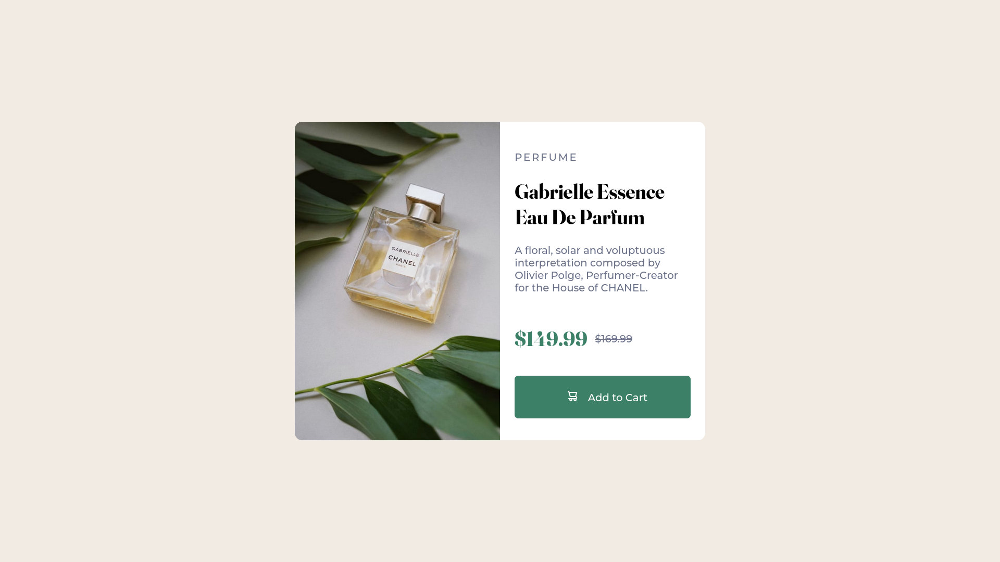

# Frontend Mentor - Product preview card component solution

This is a solution to the [Product preview card component challenge on Frontend Mentor](https://www.frontendmentor.io/challenges/product-preview-card-component-GO7UmttRfa). 

## Table of contents

- [Overview](#overview)
  - [The challenge](#the-challenge)
  - [Links](#links)
  - [Screenshot](#screenshot)
- [My process](#my-process)
  - [Built with](#built-with)
  - [What I learned](#what-i-learned)
  - [Continued development](#continued-development)
  - [Useful resources](#useful-resources)

## Overview

### The challenge

Users should be able to:

- View the optimal layout depending on their device's screen size
- See hover and focus states for interactive elements

### Links

- [Solution](https://www.frontendmentor.io/solutions/responsive-preview-card-component-using-flexbox-k0NQA3-dbE)
- [Live Site](https://joaojgabriel.github.io/card/)

### Screenshot



## My process

### Built with

- Semantic HTML5 markup
- CSS custom properties
- Flexbox
- CSS Grid (minimally)

### What I learned

It might not be as neatly organized as defining the sizes in the Grid container, but making a card object using Flexbox is really doable. Aditionally, it makes more sense since the design is made up of nested one-dimensional components. This is the kind of workaround needed:

```css
.content {
  flex: 1;
  display: flex;
  flex-direction: column;
  justify-content: space-between;
}

.description {
  flex: 2;
  display: flex;
  flex-direction: column;
  justify-content: space-between;
}
```

The proportion of space each flex item will use (or grow to use) has to be defined in each item using `flex-grow` (with the `flex` shorthand). 

### Continued development

I'll continue to work on my Flexbox skills to make the workflow faster.

### Useful resources

- [A Modern CSS Reset](https://piccalil.li/blog/a-modern-css-reset/) - I copied this reset, to get the overhead out of the way, and adapted it to use only what was useful,
- [MDN HTML Guide - Responsive Images](https://developer.mozilla.org/en-US/docs/Learn/HTML/Multimedia_and_embedding/Responsive_images#how_do_you_create_responsive_images) - This gave me a quick brush up on art direction using the `<picture>` element.
